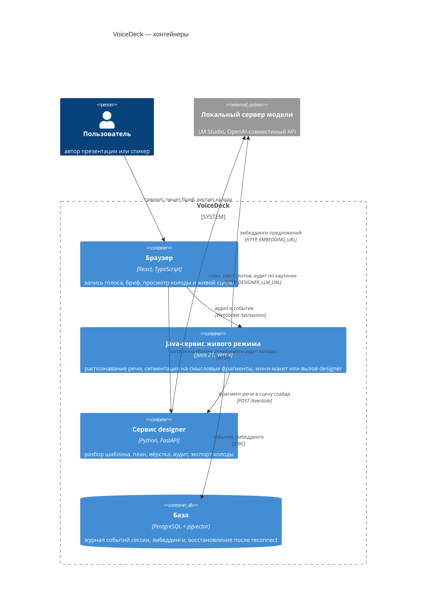

# Архитектура сервиса `designer`

Конвейер ведёт слайд от pptx-шаблона и брифа до готовых файлов по слоям: разбор, план,
вёрстка, аудит, экспорт. Каждый слой читает и пишет только контракты из
`designer/src/designer/contracts.py`, слоя соседа не знает. Оркестрирует слои
`designer/src/designer/pipeline.py`.

## Слои конвейера

| Слой | Каталог | Вход | Выход | Контракт (`contracts.py`) | Чего слой не делает |
|---|---|---|---|---|---|
| Разбор | `parse/` | файл pptx | `DesignSystem`: токены, ассеты, шрифты, слайды-образцы как паттерны, макеты | `Tokens`, `Asset`, `Pattern`, `LayoutInfo`, `DesignSystem` | не решает, что писать на слайде; модель зовёт только один необязательный шаг — уточнение паттерна по картинке (`parse/describe.py`) |
| План | `plan/` | бриф, назначение, аудитория, число слайдов | `DeckPlan`: список `SlideIntent` | `DeckPlan`, `SlideIntent`, `ChartSpec`, `TableSpec` | не подбирает паттерн и не вёрстает; числа, которых нет в брифе, вычищает код после ответа модели (`plan/planner.py`) |
| Вёрстка | `layout/` | `SlideIntent` (после `plan/writer.fill_slots` под лимиты паттерна) и `DesignSystem` | `SlideSpec` (инструкция сборки: что в какой слот, кегли после подгонки, что убрать со слайда) и `Scene` (готовая геометрия) | `SlideSpec`, `Scene`, `Element` | не пишет файлы; не решает, что показывать на слайде — это решил план |
| Аудит | `audit/` | список `Scene` + `DesignSystem` (детерминированные проверки); `Scene` + картинка слайда + текст брифа (контекстные проверки) | список `Finding` | `Finding` | сама находки не чинит: починка — отдельный шаг `audit/fixes.py` по выбору человека; контекстные проверки сцену не меняют |
| Экспорт | `export/` | `SlideSpec[]` / `Deck` + `DesignSystem` | `deck.pptx` (клон слайдов-образцов), `deck.html`, `deck.pdf`, `png/` | — (пишет файлы, не модели) | не принимает решений вёрстки — исполняет решения слоя «Вёрстка» буквально |

Общая инфраструктура, не входящая в конвейер как отдельный слой контента:

| Модуль | Вход | Выход | Чего не делает |
|---|---|---|---|
| `llm/` | системный и пользовательский текст, JSON-схема ответа, картинки (опционально) | JSON-объект по схеме (`llm/client.py`), версия и хеш использованного скилла (`llm/skills.py`), карточка прогона (`llm/run.py`) | не хранит бизнес-логику: промпты и параметры модели лежат файлами в `designer/skills/`, не в коде |
| `viz/` | `ChartSpec` / `TableSpec` + токены дизайн-системы | родная диаграмма или таблица PowerPoint (`viz/pptx_native.py`) либо SVG для HTML (`export/svg_chart.py`) | не решает, где на слайде место под визуализацию — рамку даёт слой «Вёрстка» |
| `pipeline.py` | pptx + бриф (обычная колода) или фрагмент речи (живой режим) | `Deck`, файлы и находки в `designer.store`, событие на каждый шаг | не содержит своей бизнес-логики разбора, плана, вёрстки или аудита — только вызывает перечисленные слои по порядку |
| `api/app.py` | HTTP-запросы FastAPI | HTTP-ответы, файлы по ссылке | не содержит бизнес-логики — вызывает `pipeline` |

## Схема контейнеров (C4, уровень контейнеров)

Распознавание речи (GigaAM-v3) и определение конца фразы (Silero VAD) не отдельные
контейнеры: обе модели работают в процессе Java-сервиса через sherpa-onnx.
Сервис `designer` описан в `compose.yaml` третьим контейнером: образ `python:3.12-slim` с
LibreOffice и poppler, промпты скопированы в `/app/skills`, данные в томе `designer-data`.

## Как решается незнакомый шаблон

Разбор не знает заранее, какие слайды есть в шаблоне: на защите будет шаблон, которого
команда не видела. `parse/patterns.py` строит паттерн каждого слайда-образца из его
геометрии, без словаря готовых макетов:

1. **Паттерны по геометрии.** Фигуры слайда разворачиваются из групп в плоский список
   с координатами в долях слайда (`flatten_shapes`). Повторяющиеся фигуры одной формы и
   размера, расставленные с постоянным шагом, собираются в `RepeatGroup` — блок карточек,
   шагов или строк списка (`geo.find_repeats`).
2. **Связанные группы.** Две группы, которые движутся синхронно с одним и тем же шагом
   (`geo.in_lockstep`), считаются одним смысловым блоком: ряд кружков с номерами и ряд
   подписей под ними — это шаги, а не два независимых списка (`_link_groups`).
3. **Заглушки.** Серая фигура без насыщенного цвета (круг, овал, скруглённый прямоугольник)
   или плоская картинка без деталей помечается местом под будущее фото (`Area.placeholder`,
   `_is_photo_placeholder`, `_flat_gray_image`). Паттерн, который держится на такой заглушке,
   `layout/match.fits` отбраковывает для слайда без своих картинок.
4. **Описание по картинке.** Геометрия говорит, из чего слайд собран, но не для какого он
   содержания. При импорте `parse/describe.py` отдаёт модели картинку каждого слайда-образца
   и то, что уже известно (число слотов, блоков, областей); модель возвращает назначение
   слайда одной фразой и флаг «держится на фото» (плашка под фото бывает вшита в фон макета,
   геометрия её не видит). Тип модель меняет только при уверенности разбора ниже 0,7.
   Запросы с картинками идут по одному: в несколько потоков локальный сервер отвечает иначе.
5. **Картинка макета.** Макет с картинкой на весь кадр помечается `LayoutInfo.full_bleed_picture`:
   подложки и номера блоков в ней нарисованы, убрать лишний блок с неё нельзя. Такой паттерн
   `layout/match.fits` берёт только под число блоков как в образце, а слайд с диаграммой
   экспорт переводит на самый чистый макет того же мастера (`export/pptx_deck._relayout_if_bare`).

Тип слайда (`SlideKind`) — эвристика по составу: наличие диаграммы или таблицы, крупное
число, число блоков в главной группе, короткие подписи под фото (команда), номера в блоках
(шаги), самая крупная картинка с текстом рядом (текст с картинкой) и так далее
(`parse/patterns._classify`). При подборе паттерна под слайд плана (`layout/match.py`)
чужого типа рядом нет — берётся ближайший по семье типов (`_FAMILIES`, `_NEAR`), а не
случайный.

## Три варианта вёрстки

`layout/variants.py` строит три преобразования одного и того же плана без обращения к
модели:

| Вариант | Ось различий | Как получен |
|---|---|---|
| `a` | как в шаблоне: план как есть, паттерн подбирается по точному числу блоков | план без изменений |
| `b` | плотнее: соседние слайды с одной мыслью сведены в один, карточек на слайде больше | слайды с ≤ 2 пунктов той же природы (список, карточки, шаги, повестка) сливаются, пока умещаются в самый вместительный паттерн этого типа в дизайн-системе |
| `c` | данные вперёд: числа становятся крупной цифрой, диаграммой или таблицей раньше текста | один пункт с числом → тип `big_number`; два и больше — числа складываются в `ChartSpec` |

Ось обоснована одной фразой на вариант в `VARIANT_AXES` и попадает в `run.json` каждого
варианта. Отличимость на глаз достигается ещё и штрафом за повтор паттерна: варианты `a` и
`b` подбирают паттерны с чистого списка занятых, а `c` начинает с паттернов, уже выбранных
вариантом `a` (`variant_used_seed`), — `choose_pattern` штрафует их повтор сильнее, и `c`
реже повторяет паттерны `a`.

## Версии скиллов и карточка прогона

Каждый скилл — папка `designer/skills/<имя>/` с `skill.yaml` (имя, версия, параметры модели:
`temperature`, `max_tokens`, `reasoning_effort`) и `prompt.md` (сам промпт). `llm/skills.py`
считает sha256 обоих файлов при каждой загрузке: версия и хеш вместе однозначно определяют,
каким именно промптом собран слайд.

`llm/run.py.RunRecorder` копит по прогону: модель (`LlmClient.model`), список
использованных скиллов с версией и хешем (`use_skill`, без повторов), время каждого этапа
конвейера (`stage`, суммируется при повторном входе в этап). `pipeline.generate_deck`
пишет карточку в `run.json` варианта колоды (`designer.store.save_run`) вместе с осью
варианта. Скилл, зашитый в другую версию промпта, даёт другую колоду — карточка прогона это
показывает.
