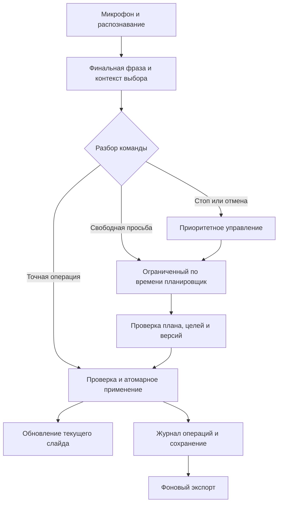

# Полноценное голосовое редактирование VoiceDeck: анализ

Анализ текущего рабочего дерева и запущенных сервисов. Изменения реализации в рамках этого анализа не выполнялись. Числа задержки ниже являются целями для измерения, если явно не указано иное.

## Вывод

Основа уже существует: точные команды без LLM, атомарные планы с отменой, отбрасывание запоздалых ответов, отдельный экспорт. Главные пробелы: два разных документа и исполнителя, неполный серверный набор операций, нет сквозной отмены вычислений и общего ограничения времени, команда может быть ошибочно принята быстрым обработчиком.

Гарантия должна относиться к редактору: он принимает управление, завершает ожидание в ограниченное время, сохраняет документ и не применяет устаревший результат. Обещать отсутствие зависаний внешнего inference-процесса нельзя. Его зависание должно оставаться локальным отказом сервиса, из которого приложение восстанавливается.

## Подтверждённые проблемы

| Приоритет | Наблюдение | Последствие и место в коде |
|---|---|---|
| P1 | Два формата документа | `stage/voiceEditor.ts` хранит браузерные компоненты; `designer/contracts.py` и `edit.py` работают с серверными Scene/SlideSpec. В первом пути таблицы, группы и диаграммы, во втором сохранение колод и PPTX. Нет единого законченного маршрута. |
| P1 | Составная команда теряет действия | `quickVoice.ts:19` перехватывает любой подходящий префикс создания. Воспроизведённая фраза про заголовок и две карточки создаёт один заголовок с текстом всей инструкции. |
| P1 | Таймаут браузера не прекращает серверное выполнение | `voiceEditor.ts:26` ждёт 30 секунд. Текущий маршрут `/editor/intent` использует назначение `live`; `agents.client_for()` создаёт LlmClient с типовым timeout 120 секунд, `complete_json()` допускает до трёх попыток при неверном JSON. Сквозного deadline и request cancellation нет. |
| P1 | Две разные ошибки конкурентности | В `EditPage.tsx:120` обычные команды последовательно ждут долгую `askSlide`; срочное восстановление обходит очередь. В `voiceEditor.ts:43` новая свободная команда отменяет ожидание предыдущей: независимые последовательные просьбы могут теряться. |
| P1 | Голосовой «Стоп» зависит от того же ASR | `Audio.java:36` повторно декодирует растущий фрагмент каждые 0,5 секунды аудио; `Models.java:94` делает decode синхронным и общим для сессий. Если native decode зависнет, новые финальные фразы, включая «Стоп», не придут. |
| P1 | Почти нет свободной VRAM | Во время проверки RTX 5090 Laptop GPU: 24 114 / 24 463 MiB занято. Одновременно видны процессы LM Studio и Ollama. Это риск конкуренции ресурсов; конкретный OOM или swap этим снимком не доказан. |
| P2 | В модель отправляется вся презентация | `voiceEditor.ts:45-49`: полное клонирование и JSON документа. Это повышает стоимость обработки и риск переполнения контекста; изменение даже выбора/другого слайда отменяет план по сравнению полного snapshot. |
| P2 | Большие синхронные копии на UI-потоке | `checkpoint`, `save`, `applyPlan` копируют/сериализуют весь документ, история хранит до 100 снимков. Изображения data URL дополнительно раздувают localStorage и историю. Порог начала торможения ещё не измерен. |
| P2 | Контракт обычной серверной правки не содержит command_id/base_revision | В `api/schemas.py` отсутствуют поля для дедупликации повторных записей и проверки версии клиента. Серверная блокировка защищает только один процесс; автоматический retry после сетевого обрыва делать нельзя. |
| P2 | Сопоставление PPTX по геометрии | `export/pptx_deck.py:399` выбирает фигуру по расстоянию до original_box; shape_id служит дополнительным критерием. Плотные и перекрывающиеся фигуры требуют стабильной привязки исходного объекта. |

В альтернативной, сейчас не настроенной в контейнере, ветке `DESIGNER_EDITOR_LLM_URL` есть два запроса с HTTPX timeout 55 секунд. Это тоже не общий deadline. HTTPX ограничивает отдельные сетевые ожидания, а не всю длительность операции: [официальная документация](https://www.python-httpx.org/advanced/timeouts/).

Запущенный контейнер назначает `deck`, `live`, `describe` на `local:qwen/qwen3.8-27b`; editor-specific переменные отсутствуют. В Ollama во время проверки загружены `qwen3:8b` и `bge-m3-embed`. Утверждение из старого руководства, что редактор обязательно работает через Ollama 27B, не соответствует этой конфигурации.

## Функциональный объём

| Область | Голосовые действия, необходимые для полноценного рабочего сценария | Текущий пробел |
|---|---|---|
| Выбор | По постоянному номеру, типу, тексту, положению; несколько объектов; «его», «остальные»; уточнение голосом | Постоянные номера есть в браузерной модели, серверный редактор выбирает по позиции в списке |
| Геометрия | Сдвиг, размер, поворот, выравнивание, интервалы, распределение, порядок слоёв, блокировка | Часть реализована только в браузерном редакторе; нет общего относительного layout |
| Текст | Диктовка, замена слова/диапазона, пунктуация, списки, стили отдельных слов, размер и цвет, переносы | Основной формат хранит одну строку и стиль целого блока; нужны текстовые диапазоны и структурированные абзацы |
| Объекты | Создать, удалить, дублировать, перенести на слайд, группировать, разгруппировать | Серверный прямой API ограничен текстом, заголовком и фигурой |
| Изображения | Найти, выбрать вариант, заменить, кадрировать, вписать, сохранить пропорции, прозрачность | Есть поиск и contain/cover; нет полноценного управления crop и общего PPTX-маршрута |
| Таблицы | Ячейка/диапазон, строки, столбцы, ширина, сортировка, оформление | План возвращает rows целиком; нужна операция изменения одной ячейки и точный адрес |
| Диаграммы | Тип, категории, серии, значения, оси, подписи и легенда | Браузерный renderer рисует столбики из одного массива неотрицательных значений |
| Композиция | «Три карточки в ряд», «под заголовком», «одинаковый отступ», «сохрани композицию» | Модель вычисляет координаты; устойчивых связей между объектами нет |
| Документ | Слайды, тема, фон, заметки, сохранение, открытие, экспорт, показ, отмена/повтор | Компонентный редактор экспортирует только HTML/JSON, серверный путь неполон по объектам |

Первая целевая граница: эти операции для нативных элементов VoiceDeck и явно поддерживаемых PPTX-объектов. Анимация, SmartArt, встроенное видео и другие сложные структуры PowerPoint требуют отдельной матрицы поддержки. Их наличие нельзя молча заменять изображением или терять при экспорте.

## Предлагаемое исполнение

1. Один документ с устойчивыми `slide_id`, `element_id`, `voice_number`, версией документа и версиями элементов. Сохранить связь с исходным PPTX shape/part. UI-компоненты и экспорт строятся из него. Миграция сохраняет существующие пользовательские правки.
2. Один типизированный набор операций для мыши, голоса и модели: select, insert, delete, duplicate, move, resize, set_style, text_replace, table_set_cell, chart_set_data, group, align, distribute и операции слайдов.
3. Быстрый разбор возвращает `matched`, `needs_planner` или `ambiguous`. `matched` означает, что разобрана вся команда. Необработанный хвост запрещает частичное выполнение. Текст диктовки защищён отдельным режимом и буквальными диапазонами.
4. Планировщик получает текущий слайд, выбранные объекты и компактный индекс остальных слайдов. Дополнительные данные загружаются по потребности. Модель описывает смысл операции и ограничения, геометрию рассчитывает исполнитель.
5. Для структуры макета ввести устойчивые правила: строка/колонка/сетка, привязка к объекту, отступ, равные размеры. Ручная координата остаётся поддерживаемой явной операцией. Ограничения хранятся в документе, чтобы изменение текста не разрушало композицию.
6. Перед записью проверять существование целей, допустимые свойства, переполнение текста, границы, зависимые версии. Один составной план применяется целиком и отменяется одним действием. Ошибка не оставляет половину изменений.
7. Запросы имеют `command_id`, `request_id`, `base_revision`, `deadline`, `target_ids`. Сохранение повторной команды с тем же ID возвращает исходный результат. Нужны состояния accepted/planning/clarifying/applying/applied/cancelled/failed/expired.
8. Простые независимые правки продолжаются, пока модель думает. Конфликтующие изменения одного объекта сохраняют порядок. Новая просьба заменяет старую только при явном исправлении той же операции; общий принцип «последняя команда побеждает» неприемлем.
9. При timeout записи клиент запрашивает статус command_id: «не применено» и «применено, ответ потерян» различаются. «Стоп» отменяет pending/planning; уже применённая операция отменяется отдельной undo-транзакцией.

Уточнения и результаты должны быть доступны голосом: «Нашёл две карточки. Номер 2 или 5?», «Выполнено», «Модель недоступна, точные команды работают». Для TTS требуется защита от распознавания собственного ответа и поддержка прерывания пользователем. Первое разрешение доступа к микрофону остаётся системным действием браузера.

## Как ограничить задержки и зависания

- Точные операции, выделение, навигация, диктовка и отмена не вызывают LLM. Это обязательное поведение даже при недоступном сервере модели.
- Вынести ASR из общей синхронной критической секции: потоковая сессия или изолированный worker с ограничением длительности обработки. Нативный зависший decode должен перезапускаться отдельно от сессии документа.
- Аудиоочередь контролировать по возрасту данных, а не только числу пакетов. Текущие 1000 пакетов по 32 мс допускают около 32 секунд накопленного аудио до переполнения. Отдельно измерять задержку final и доступность «Стоп».
- Для голосового прерывания во время сбоя ASR нужен независимый лёгкий распознаватель ограниченного набора управляющих слов либо отдельный канал управления; «Стоп» в той же заблокированной очереди не является аварийным остановом.
- Один активный запрос интерактивного планирования на сеанс; небольшая ограниченная очередь с видимым состоянием. Ограничить суммарную конкуренцию на inference-сервис. Не увеличивать параллелизм для борьбы с очередью при заполненной памяти.
- Использовать сквозной monotonic deadline на сервере, включая очередь, соединение, генерацию и исправление JSON. После истечения времени не начинать новую попытку. Клиентский AbortController остаётся дополнительной защитой.
- Отмена должна закрывать upstream-запрос и помечать задание отменённым. Прекращение вычислений проверять для конкретного backend; при отсутствии поддержки изолировать worker и использовать watchdog. Отмена не должна перезапускать общий сервер чужих задач.
- При повторяющихся сбоях временно отключать маршрут модели с понятным статусом; быстрые команды сохраняют работоспособность. Проверка восстановления должна быть короткой и не порождать лавину повторов.
- События queued/started/first-token/validated/applied дают видимый прогресс. Потоковые токены могут показывать ход работы, но неполный JSON не применяется к документу.
- Перейти от полного JSON-снимка к патчам документа и ограниченному undo-журналу; assets хранить отдельно по ID. Долговременное сохранение выполнять асинхронно. Переделывать текущий renderer целиком без измерения нагрузки не требуется.
- Оставить экспорт вне цикла отображения, как уже сделано в `edit_runtime.py`. Добавить deadline экспортера и статус задания; `future.result()` в скачивании сейчас не имеет явного срока ожидания.

Ollama официально описывает очереди при недостатке памяти и рост памяти с параллельными контекстами: [FAQ](https://docs.ollama.com/faq). Для Ollama-ветки передавать JSON Schema в `format`, а не только `"json"`, и сохранять проверку семантики плана: [Structured Outputs](https://docs.ollama.com/capabilities/structured-outputs).

## Выбор модели и оборудования

Сначала исправить исполнение и измерить фактический маршрут. Имеющийся `qwen3:8b` можно сравнить с текущей 27B-моделью на одном наборе команд как кандидата для коротких планов; его качество для этой роли ещё не доказано. Сложное переписывание текста и создание композиции допустимо отправлять более сильной модели отдельной фоновой задачей.

Не загружать вторую крупную модель поверх почти заполненной VRAM. Для замера выбрать контролируемый профиль ресурсов, держать интерактивную модель прогретой и оставить запас памяти для контекста. Выгрузка текущих моделей и изменение назначений в этом анализе не выполнялись. ASR сейчас настроен на CPU; его скорость нужно измерять отдельно от GPU-генерации.

Начальные размеры context/output подбираются по реальным схемам операций. Замена одной ячейки не должна отправлять таблицу и всю презентацию туда и обратно. Итоговый выбор модели определяется точностью целей и правок, p95 задержки и долей timeout, а не только размером модели.

## Цели приёмки

Это предлагаемые требования, не уже достигнутые измерения:

| Сценарий | Начальная цель |
|---|---|
| Финальная распознанная точная команда -> первый кадр изменения | p95 <= 150 мс локального применения |
| Конец речи -> первый кадр точной правки | p95 <= 1 секунды на целевой машине |
| Финальная фраза -> сложный валидный план | p95 <= 3 секунд для интерактивного набора; deadline 8 секунд |
| Получен управляющий intent «Стоп» -> отмена ожидания | <= 100 мс; отдельно измеряется распознавание самого слова |
| Зависшая модель | Точные правки и отмена доступны; после deadline нет применения позднего результата |
| Целостность | Ни одного применения устаревшего плана, двойной записи или частично выполненной команды в тестах отказов |
| Объём | 50 слайдов, до 100 объектов на текущем слайде; отдельно проверить предельные размеры документа |

Собирать временные отметки audio_end, asr_final, parsed, model_queued, model_started, first_token, plan_validated, committed, first_paint, persisted. Метрики EditPage сейчас стартуют после ожидания очереди; они не являются сквозной голосовой задержкой. Сравнивать p50/p95/p99, не один удачный запрос.

Набор приёмки должен включать:

- Последовательность из 100 команд с повторами, перефразировками и несколькими темпами речи.
- Составную просьбу «заголовок и две карточки», числовые размеры, отрицание «не меняй цвет», исправление «нет, на десять».
- Диктовку с паузой более 8 секунд, пунктуацией, числами, словом «команда» внутри текста и уточнением цели.
- Изменение таблицы без потери соседних ячеек; диаграмму с отрицательными числами и несколькими сериями.
- Задержку/обрыв модели, невалидный JSON, поздний ответ, двукратную доставку ASR, сетевой обрыв после серверной записи.
- Быструю правку и навигацию во время планирования; отключение и переподключение микрофона; несколько сессий ASR.
- Перезапуск, повторное открытие, undo/redo и сравнение редактируемого PPTX с документом после экспорта.

## Порядок реализации

1. Исправить полное потребление команды быстрым парсером; добавить сквозные метрики, общий deadline и управляемые задания модели. Приёмка: простые команды работают при искусственно зависшей модели, compound-команда не теряется.
2. Объединить формат документа и исполнение операций, стабильные номера, версии и command_id; подключить серверное сохранение браузерного редактора. Приёмка: одинаковые действия голосом и мышью дают одинаковый документ после перезагрузки.
3. Завершить операции текста, картинок, таблиц, диаграмм, групп и макета; единые уточнения и голосовая отмена. Приёмка: функциональный корпус и визуальные проверки.
4. Проверить ASR и модель на целевой машине, уменьшить контекст и конкуренцию, выбрать модель по замерам. Приёмка: аудиотесты и fault injection с заданными p95/deadline.
5. Закрыть редактируемый PPTX и проверку соответствия preview/export; сохранить неподдерживаемые исходные объекты без повреждения.

## Что проверено в этом анализе

- 51 frontend-тест в quickVoice/editorConcurrency/editorOperations/deckVoice/voiceCommandQueue/request прошёл.
- 10 backend-тестов edit_runtime/editor_api/element_position прошли.
- Ошибка составного создания воспроизведена запуском текущего TypeScript без сети и без записи презентации.
- Прочитаны текущие назначения агентов и OpenAPI запущенного designer, состояние GPU и загруженных Ollama-моделей.
- Реальная речь пользователя, p95 полного голосового цикла, полная модельная цепочка и round-trip произвольного PPTX в этом анализе не проверялись. Успех перечисленных тестов их не заменяет.
