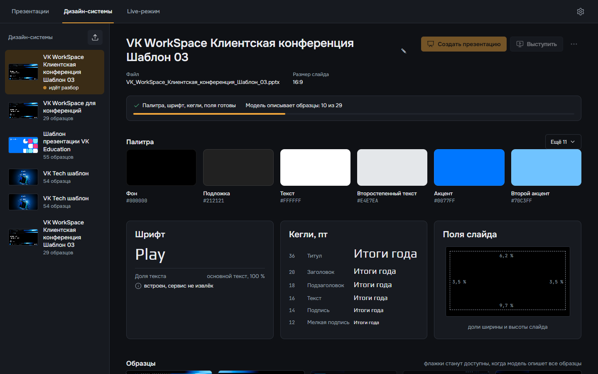
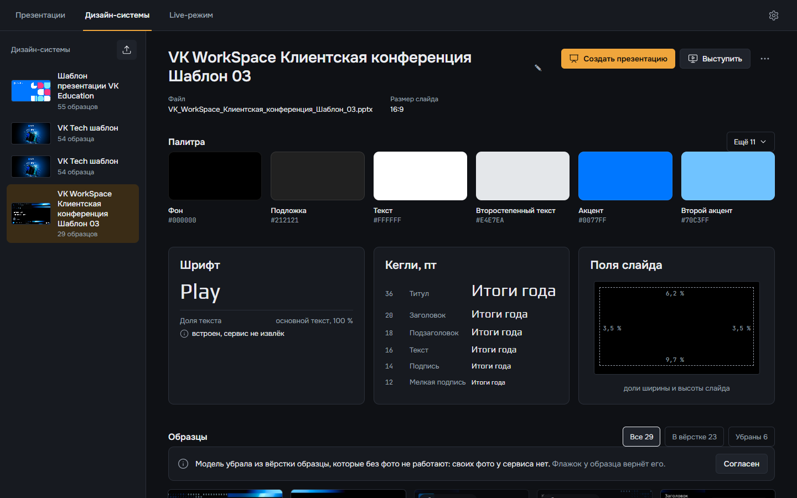
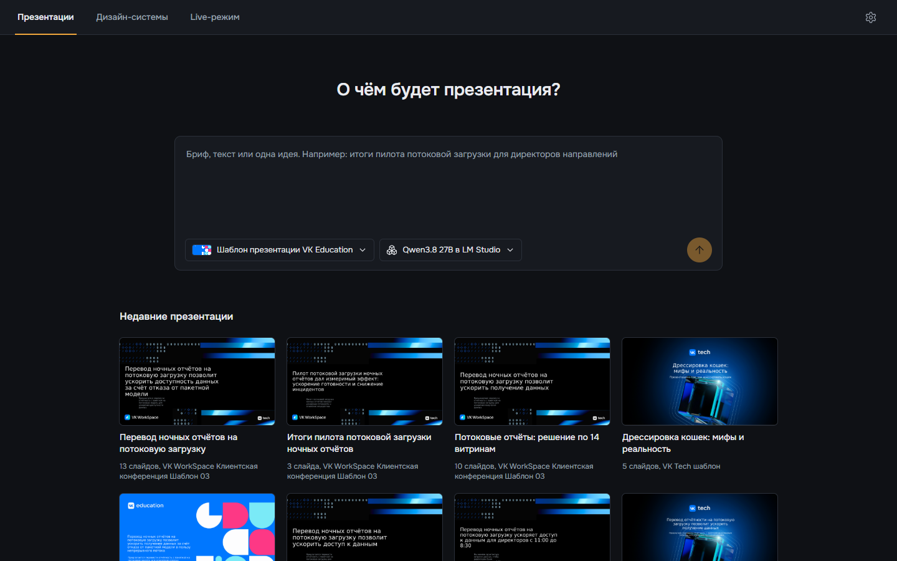
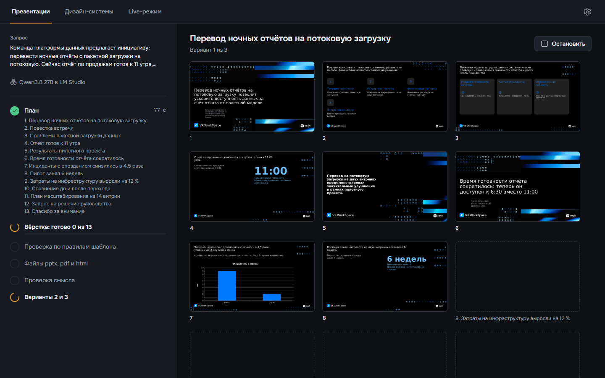
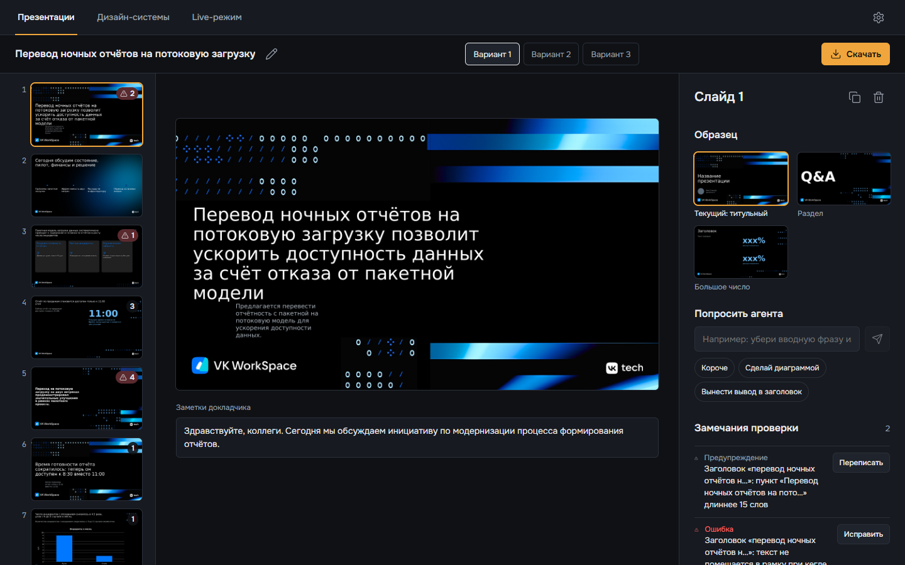

# Презентация по брифу

Нужен поднятый стек: [запуск на своей машине](zapusk.md). Агента, который пишет слайды, выбирают в настройках: [агенты](agenty.md). Без настройки работает Qwen3.8 27B в LM Studio.

## Сделать дизайн-систему из pptx



1. Откройте **Дизайн-системы** и нажмите кнопку загрузки над списком слева.
2. Выберите pptx-файл. Годится любой: файл шаблона с макетами или обычная презентация.
3. Палитра, шрифт, кегли и поля появляются через несколько секунд. Потом модель описывает каждый образец по картинке, полоса вверху показывает, сколько готово: «10 из 29».



4. Проверьте, что сервис понял верно. Имя меняется карандашом рядом с заголовком.
5. В блоке **Образцы** модель снимает с вёрстки образцы, которые без своих фото не работают. Нажмите **Согласен**, если согласны. Флажок на образце возвращает его в вёрстку или убирает из неё.
6. Если под шрифтом написано, что сервис его не извлёк, установите шрифт на машине, где будете показывать. Иначе PowerPoint откроет слайды другим шрифтом.

Кнопка **Создать презентацию** открывает главную с этой дизайн-системой, **Выступить** открывает Live-режим.

## Создать презентацию



1. Откройте **Презентации**.
2. Впишите бриф: о чём презентация, для кого, что должен решить зал. Хватает и одной идеи.
3. Под полем выберите дизайн-систему и агента.
4. Нажмите стрелку справа.



Слева видно, на каком шаге агент и сколько занял каждый шаг: план, вёрстка, проверка по правилам шаблона, файлы, проверка смысла. Список слайдов из плана появляется первым, сами слайды справа по одному, по мере вёрстки. **Остановить** прерывает работу, готовые слайды остаются.

Три варианта вёрстки на Qwen3.8 27B собираются примерно за пять минут. Страница переживает перезагрузку: генерация идёт на сервере.

## Поправить слайд



Презентация открывается на правке, когда готов первый вариант. Название меняется карандашом рядом с ним, варианты переключаются вверху.

1. Выберите слайд в ленте слева. Число на миниатюре показывает замечания проверки.
2. Нажмите на текст на слайде, чтобы его поправить. Текст остаётся после смены образца.
3. В блоке **Образец** выберите другую вёрстку того же слайда.
4. В поле **Попросить агента** напишите, что поменять, или нажмите готовую просьбу: **Короче**, **Сделай диаграммой**, **Вынести вывод в заголовок**.
5. В блоке **Замечания проверки** у каждого замечания есть действие: **Исправить** чинит вёрстку по правилам шаблона, **Переписать** отдаёт текст агенту.

Под слайдом лежат заметки докладчика, их пишет агент вместе с планом. Кнопки справа от номера слайда копируют и удаляют его.

## Скачать


Нажмите **Скачать** и выберите pptx, PDF или HTML. В pptx объекты родные: текст, фигуры, диаграммы и таблицы правятся в PowerPoint.

## Без экрана

Тот же путь через API сервиса `designer` в PowerShell:

```powershell
# загрузить pptx; в ответе поле id
curl.exe -F "file=@template.pptx" http://127.0.0.1:8090/design-systems

# создать презентацию; slide_count и variants необязательны
$body = @{ design_system_id = "<id>"; brief = "<бриф>"; slide_count = 5; variants = @("a", "b", "c") } | ConvertTo-Json
$deck = Invoke-RestMethod http://127.0.0.1:8090/decks -Method Post -ContentType "application/json; charset=utf-8" -Body ([Text.Encoding]::UTF8.GetBytes($body))

# состояние: status, план, замечания проверки, адреса картинок слайдов
Invoke-RestMethod "http://127.0.0.1:8090/decks/$($deck.deck_id)"

# файл варианта: deck.pptx, deck.html или deck.pdf
Invoke-WebRequest "http://127.0.0.1:8090/decks/$($deck.deck_id)/a/files/deck.pptx" -OutFile deck.pptx
```

Адрес `127.0.0.1`, а не `localhost`: на Windows скрипты сначала пробуют IPv6 и теряют на каждом запросе около 20 секунд.

Девять презентаций из `examples/` собирает `python examples/build.py examples/brief.txt`: скрипт берёт все pptx из `docs/requirements/template/`, на каждом собирает три варианта и кладёт файлы и лист слайдов в `examples/<шаблон>/<вариант>/`.
