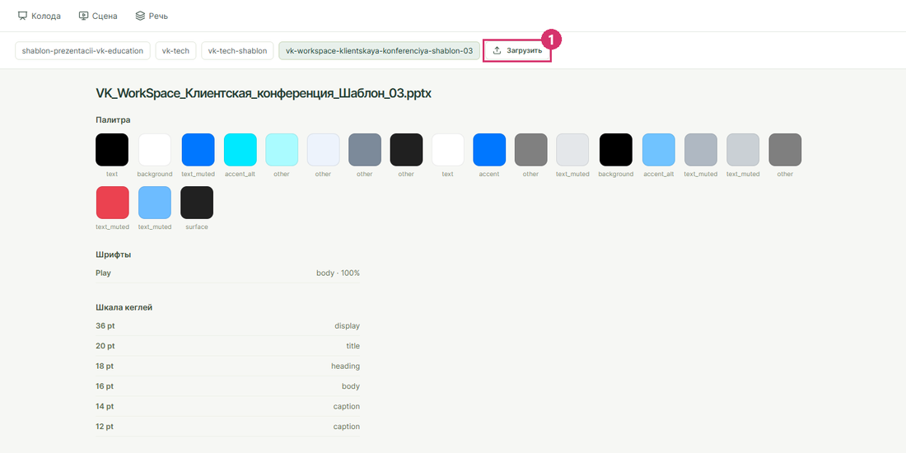
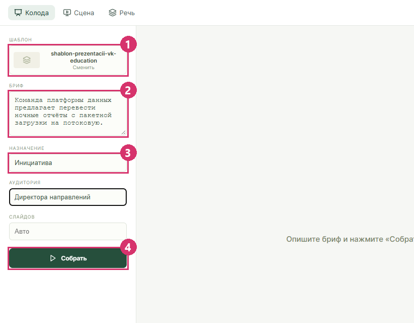
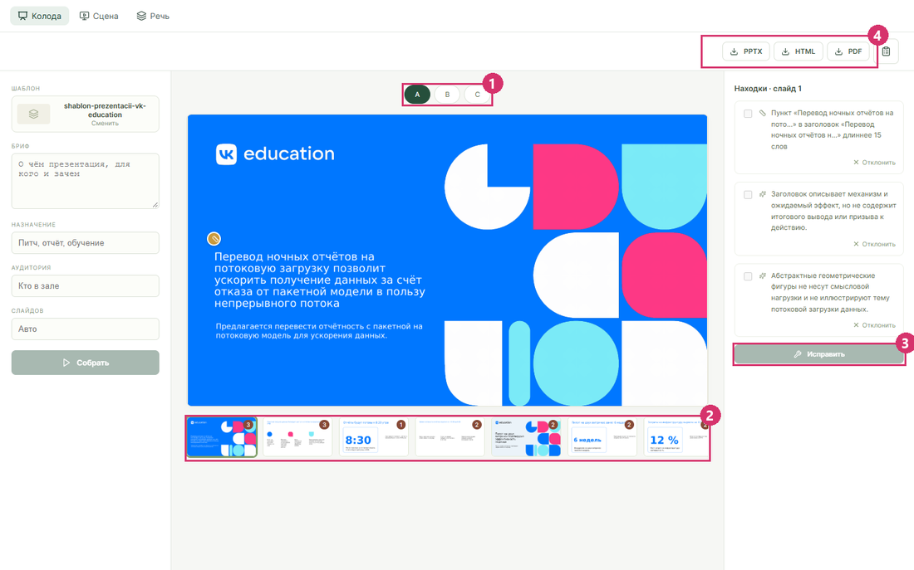

# Презентация по брифу

Нужен поднятый стек: [запуск на своей машине](zapusk.md).

## Загрузить шаблон



1. Откройте `http://localhost:8088/#/template`.
2. Нажмите **Загрузить** (1) и выберите pptx-файл шаблона.
3. Дождитесь страницы шаблона: палитра, шрифты, шкала кеглей и слайды-образцы.

Импорт идёт одну-две минуты: модель описывает каждый слайд-образец по его картинке. Шаблоном годится любой pptx, в том числе обычная презентация, а не только файл с макетами.

## Собрать колоду



1. Откройте **Колода**.
2. В блоке **Шаблон** нажмите **Сменить** и выберите шаблон (1).
3. В поле **Бриф** опишите, о чём презентация, для кого и зачем (2).
4. При желании заполните **Назначение**, **Аудитория** и **Слайдов** (3).
5. Нажмите **Собрать** (4).

Три варианта вёрстки собираются за три-пять минут. Колода остаётся на экране и после перезагрузки страницы.

## Посмотреть, починить, скачать



1. Переключайте варианты **A**, **B**, **C** над слайдом (1).
2. Выберите слайд в ленте под ним: число на миниатюре показывает находки аудита (2).
3. В панели **Находки** отметьте, что чинить, и нажмите **Исправить** (3). Ненужную находку уберите кнопкой **Отклонить**.
4. Скачайте колоду кнопками **PPTX**, **HTML**, **PDF** (4).

В pptx объекты родные: текст, фигуры, диаграммы и таблицы правятся в PowerPoint.

## Без экрана

Тот же путь через API сервиса `designer` в PowerShell:

```powershell
# загрузить шаблон; в ответе поле id
curl.exe -F "file=@template.pptx" http://127.0.0.1:8090/design-systems

# собрать колоду; slide_count и variants необязательны
$body = @{ design_system_id = "<id>"; brief = "<бриф>"; slide_count = 5; variants = @("a", "b", "c") } | ConvertTo-Json
$deck = Invoke-RestMethod http://127.0.0.1:8090/decks -Method Post -ContentType "application/json; charset=utf-8" -Body ([Text.Encoding]::UTF8.GetBytes($body))

# состояние: status, план, находки аудита, адреса картинок слайдов
Invoke-RestMethod "http://127.0.0.1:8090/decks/$($deck.deck_id)"

# файл варианта: deck.pptx, deck.html или deck.pdf
Invoke-WebRequest "http://127.0.0.1:8090/decks/$($deck.deck_id)/a/files/deck.pptx" -OutFile deck.pptx
```

Адрес `127.0.0.1`, а не `localhost`: на Windows скрипты сначала пробуют IPv6 и теряют на каждом запросе около 20 секунд.

Девять колод из `examples/` собирает `python examples/build.py examples/brief.txt`: скрипт берёт все pptx из `docs/requirements/template/`, на каждом собирает три варианта и кладёт файлы и лист слайдов в `examples/<шаблон>/<вариант>/`.
