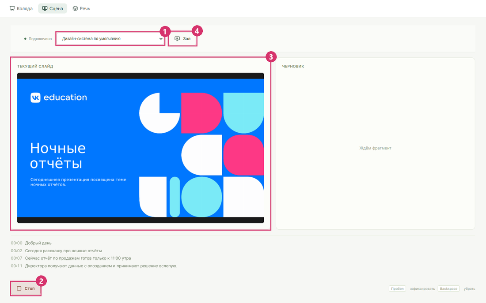

# Живой режим

Спикер говорит, Java-сервис распознаёт речь и режет её на смысловые фрагменты, `designer` превращает фрагмент в слайд по загруженному шаблону. Слайд появляется через 4–6 секунд после законченной мысли на Qwen3.8-27B.

Нужны поднятый стек, `SLIDE_MODE=designer` в `.env` и хотя бы один загруженный шаблон: [запуск](zapusk.md), [загрузка шаблона](prezentaciya-po-brifu.md#загрузить-шаблон).

## С микрофона



1. В `.env` поставьте `MODE=live` и выполните `docker compose up -d app`.
2. Откройте в Chrome или Edge `http://localhost:8088/#/stage`.
3. В списке дизайн-систем выберите шаблон (1). Пункт **Дизайн-система по умолчанию** берёт последний загруженный.
4. Нажмите **Запись** (2) и разрешите доступ к микрофону. На время записи кнопка становится **Стоп**.
5. Говорите законченными мыслями: текущий слайд слева (3), черновик следующего справа.
6. Нажмите **Зал** (4): откроется окно для экрана зрителей, клавиша F разворачивает его во весь экран.

**Пробел** сразу делает черновик текущим слайдом, **Backspace** убирает слайд с экрана зала. Микрофон браузер даёт только на `localhost` или по HTTPS.


## Из текста, без микрофона

1. В `.env` поставьте `MODE=demo` и выполните `docker compose up -d app`.
2. Откройте **Сцена** и выберите шаблон.
3. Впишите абзац в поле **Текст вместо микрофона** и нажмите стрелку.
4. Нажмите **Пробел**, когда справа появится черновик: он станет текущим слайдом и уйдёт в окно зала.

Текст проходит тот же путь, что и речь: смысловые фрагменты, слайд по шаблону, окно зала. Черновик появляется через 5–8 секунд.

## Из записи, без браузера

1. Сделайте запись русской речи голосом Windows:

   ```powershell
   pwsh scripts/speech-sample.ps1
   ```

2. Прогоните её через живой режим (нужен `MODE=live`):

   ```powershell
   node scripts/live-smoke.mjs $env:TEMP\voicedeck-speech.wav
   ```

Скрипт шлёт звук по WebSocket в реальном темпе, как браузер с микрофона, и печатает распознанные фразы. В конце идёт строка `PASS live audio` с числом фраз, фрагментов и слайдов. Своя запись годится, если это WAV: моно, 16 кГц, 16 бит.

## Один слайд через API

```powershell
$body = @{ design_system_id = ""; chunk_text = "Число инцидентов упало с 9 до 2 в месяц."; used_pattern_ids = @() } | ConvertTo-Json
$slide = Invoke-RestMethod http://127.0.0.1:8090/live/slide -Method Post -ContentType "application/json; charset=utf-8" -Body ([Text.Encoding]::UTF8.GetBytes($body))
[IO.File]::WriteAllBytes("$PWD\slide.png", [Convert]::FromBase64String($slide.image_png_base64))
```

Пустой `design_system_id` берёт последний загруженный шаблон. Ответ 204 значит «слайд не нужен», так сервис отсеивает приветствия и связки. В ответе 200 лежат сцена слайда, его HTML и картинка PNG в base64.
