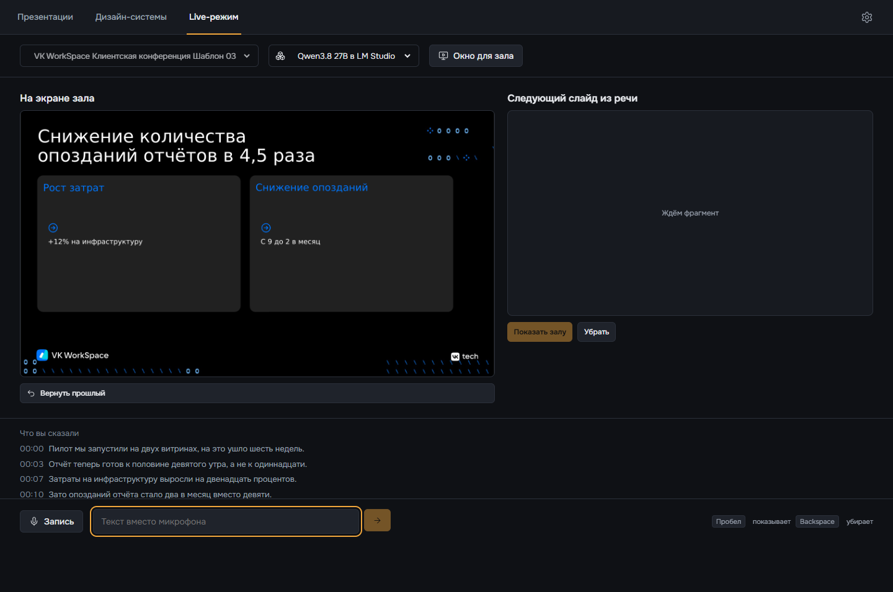
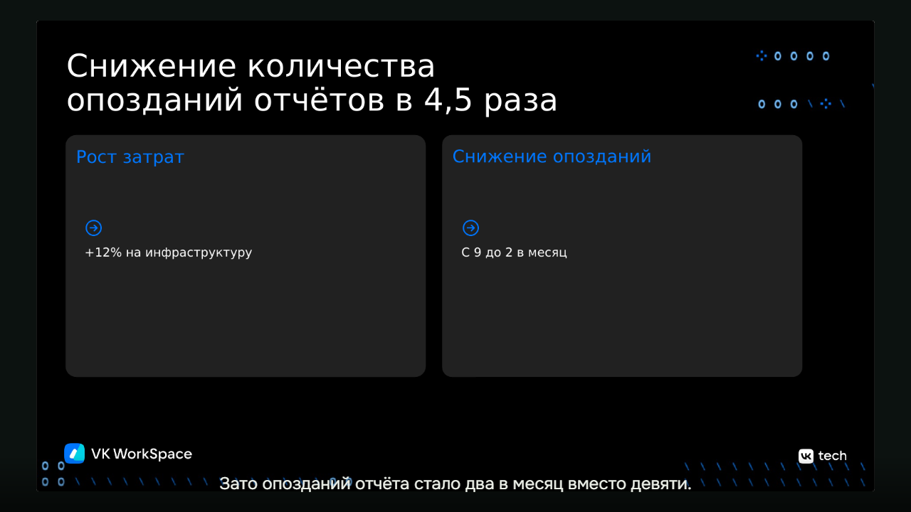

# Live-режим

Спикер говорит, Java-сервис распознаёт речь и режет её на законченные мысли, агент делает из каждой мысли слайд в выбранной дизайн-системе. На Qwen3.8 27B слайд появляется через 4–6 секунд после конца мысли.

Нужны поднятый стек, `MODE=live` и `SLIDE_MODE=designer` в `.env`, хотя бы одна дизайн-система: [запуск](zapusk.md), [дизайн-система из pptx](prezentaciya-po-brifu.md#сделать-дизайн-систему-из-pptx). После правки `.env` выполните `docker compose up -d app`.

## Выступить с микрофоном



1. Откройте в Chrome или Edge `http://localhost:8088/#/live`. С экрана дизайн-системы сюда ведёт кнопка **Выступить**, система тогда уже выбрана.
2. Вверху выберите дизайн-систему и агента. Агент по умолчанию берётся из [настроек](agenty.md). Дизайн-систему выбирают до начала: с первым слайдом список закрывается, другая система доступна после перезагрузки страницы.
3. Нажмите **Запись** внизу и разрешите доступ к микрофону. На время записи кнопка становится **Стоп**.
4. Нажмите **Окно для зала**, кнопка включается с началом выступления. Перетащите окно на экран зрителей, клавиша F разворачивает его на весь экран.
5. Говорите законченными мыслями. Пока мысль не закончена, её слайд виден справа в колонке **Следующий слайд из речи**. Когда мысль закончена, слайд сам уходит в зал и встаёт слева в **На экране зала**.

Внизу идёт текст речи с временем каждой фразы. Микрофон браузер даёт только на `localhost` или по HTTPS.

| Действие | Кнопка | Клавиша |
|---|---|---|
| показать залу слайд из правой колонки, не дожидаясь конца мысли | **Показать залу** | Пробел |
| убрать слайд с экрана зала | **Убрать** | Backspace |
| вернуть в зал предыдущий слайд | **Вернуть прошлый** | нет |



## Текст вместо микрофона

Поле **Текст вместо микрофона** внизу работает, пока запись не идёт. Впишите абзац и нажмите стрелку. Текст проходит тот же путь, что и речь: законченные мысли, слайд по дизайн-системе, окно зала. Удобно для репетиции и для проверки без микрофона.

## Из записи, без браузера

1. Сделайте запись русской речи голосом Windows:

   ```powershell
   pwsh scripts/speech-sample.ps1
   ```

2. Прогоните её через Live-режим:

   ```powershell
   node scripts/live-smoke.mjs $env:TEMP\voicedeck-speech.wav
   ```

Скрипт шлёт звук по WebSocket в реальном темпе, как браузер с микрофона, и печатает распознанные фразы. В конце идёт строка `PASS live audio` с числом фраз, фрагментов и слайдов. Своя запись годится, если это WAV: моно, 16 кГц, 16 бит.

## Один слайд через API

```powershell
$body = @{ design_system_id = ""; chunk_text = "Число инцидентов упало с 9 до 2 в месяц."; used_pattern_ids = @() } | ConvertTo-Json
$slide = Invoke-RestMethod http://127.0.0.1:8090/live/slide -Method Post -ContentType "application/json; charset=utf-8" -Body ([Text.Encoding]::UTF8.GetBytes($body))
[IO.File]::WriteAllBytes("$PWD\slide.png", [Convert]::FromBase64String($slide.image_png_base64))
```

Пустой `design_system_id` берёт последнюю загруженную дизайн-систему. Ответ 204 значит «слайд не нужен»: так сервис отсеивает приветствия и связки. В ответе 200 лежат сцена слайда, его HTML и картинка PNG в base64.
